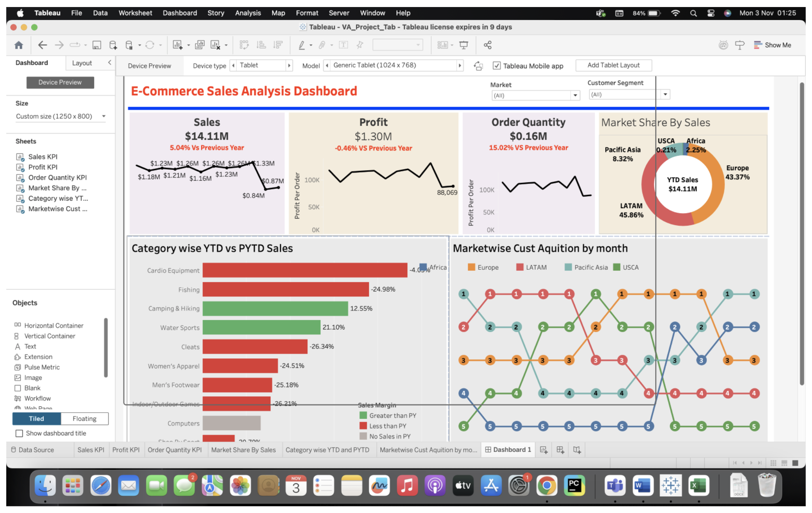

# E-commerce Sales Dashboard Analysis

An interactive and dynamic Tableau data visualization project designed to analyze e-commerce transactions, track performance trends, and unlock data-driven business insights.

## 👤 Project Author
* **Developer:** Ronit Gandhi
* **Academic Details:** BTech IT, 3rd Year, Semester 5

---

## 📷 Dashboard Preview
Below are screenshots of the interactive Tableau interface built for this analysis:

<!-- First Screenshot -->

  

---

## 📊 Project Overview
The objective of this project is to transform raw e-commerce transaction data into meaningful visual assets to assist stakeholders in optimizing business performance. The visualizations answer critical strategic business questions:
* Which geographic regions contribute the most to total sales?
* What are the top-performing product categories and specific items?
* How do metrics like sales volume and overall profit fluctuate over time?
* Which customer segments provide the highest business value?

---

## 📁 Repository Contents
* **`VA_Project_Tab.twb`**: The primary Tableau Workbook file containing the calculated fields, visual layouts, and interactive dashboard configurations.
* **`Sales_Dataset.csv`**: The underlying transactional dataset used to feed the visualizations (sourced via open data repositories like Kaggle).

---

## 🛠️ Data Pipeline & Process (ETL)

### 1. Extract
* Imported raw transaction details from the source CSV file directly into Tableau for validation.

### 2. Transform
* Handled data cleansing by removing null variables, correcting date formats, and standardizing categorical field values.
* Engineered custom calculations inside Tableau to extract deeper insights:
  * `Profit Margin` = `(Profit / Sales) * 100`
  * Extracted discrete `Year` and `Month` tracking fields from raw `Order Date` parameters.
* Filtered out incomplete or invalid transactional rows.

### 3. Load
* Successfully mapped the structured data onto dynamic Tableau operational views for high-performance dashboard rendering.

---

## 📈 Dashboard Features & KPIs
The final interactive deliverable tracks critical metrics across major operational dimensions:

* **High-Level KPIs Tracked:**
  * **Total Sales:** $14.11M
  * **Total Profit:** $1.30M
  * **Additional Metrics:** Average Discount rates and overall Order Quantity.
* **Visual Interfaces Created:**
  * **Sales Overview:** Line charts mapping metrics over time and category-wise bar distributions.
  * **Market Share & Regional Splits:** Pie breakdowns representing regional divisions (e.g., LATAM, USCA, Europe, Africa, Pacific Asia).
  * **Category wise YTD vs PYTD Sales:** Clear indicators tracking current year progress versus past benchmarks.
  * **Marketwise Customer Acquisition:** Monthly trend mapping across consumer categories.

---

## 🚀 Future Enhancements
* Transitioning the dataset connection from static CSV files to live SQL databases or cloud storage for real-time reporting updates.
* Leveraging built-in Tableau predictive modelling tools to map out forward-looking sales forecasting.
* Applying statistical clustering filters to automate micro-segmentation profiles for consumers.
